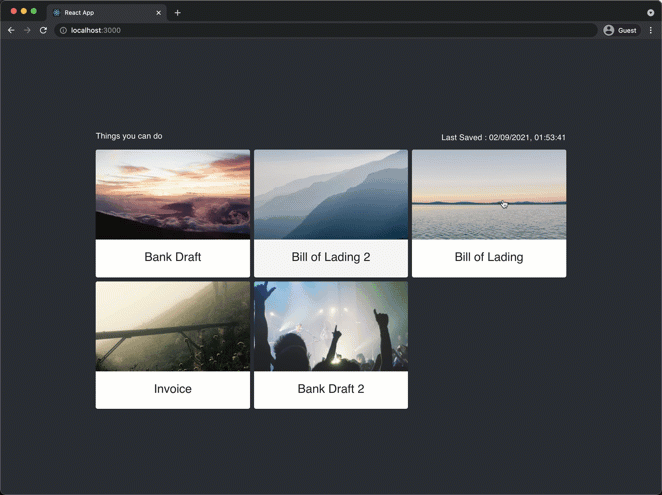

# Cards



React application that demonstrates user interactions on Cards like drag and drop. It uses FastAPI for the backend for serving the data rendered in the UI.

## Features

 - Displays a set of cards in the UI
 - Data is fetched from the backend
 - Cards can be reordered by drag and drop
 - Dialog box to show details of the card on click
 - Spinner while image is loading on the card
 - Order of cards get saved in the backend every 5 seconds, if it gets changed
 - UI shows when it wsa last saved
 - UI shows a spinner while the data is getting saved
 - On every push to the ```main``` branch, the docker images for ui and backend are built and pushed using a [Github Action](.github/workflows/build-push.yml)

## Components
 - Frontend built on React
 - Backend built on FastAPI
 - Database - PostgreSQL
### Frontend

Frontend is built on React using [create-react-app](https://create-react-app.dev/).

[More Details](./ui/README.md)

### Backend

Backend is built using FastAPI. It can use either PostgreSQL or SQLite as it's database. There is only one entity for CRUD operations, that is 'Card'.

[More Details](./api/README.md)

### Database

PostgreSQL is used as the Database. pgAdmin is also provided in the [docker-compose](./docker-compose.yaml) file for viewing the DB data

## How to run

For demoing the application, it can be run by installing Docker and running

```sh
docker-compose up -d
```
[Frontend](http://localhost:8080) | [pgAdmin](http://localhost:5050) (```foo@bar.com``` : ```password```)

Use ```docker-compose down``` to stop the application.

For development, the application can be run as follows

 - Install Python 3 and Node.js
 - Install poetry

```sh
pip install poetry
```

 - Go to ```api``` folder and initialize it and run it by,

```sh
cd api
poetry install
poetry run uvicorn app.main:app --reload
```

 - Test it works properly by opening [http://localhost:8000/api/cards](http://localhost:8000/api/cards) and see if the JSON of cards is displayed.

 - Install yarn

```sh
npm install -g yarn
```

 - In an other terminal, initialize and run UI by,

```sh
cd ui
yarn install
yarn start
```

 - UI can be opened from [http://localhost:3000](http://localhost:3000)

 - The above steps will run the application using SQLite. If you want to use PostgreSQL, give the URL of the running instance in an environment variable like this for Linux/Mac

```sh
export DATABASE_URL=postgresql://<username>:<password>@<host>/<databasename>
```
